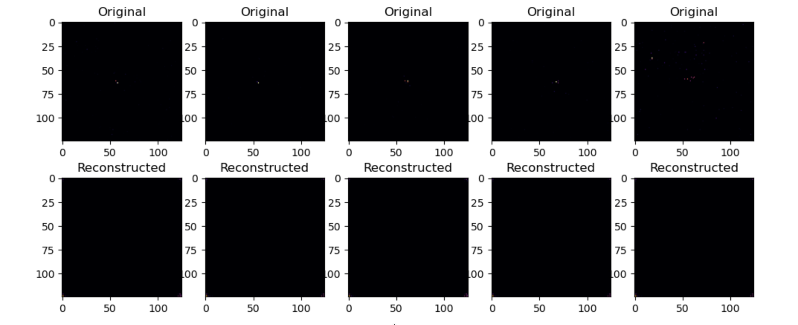
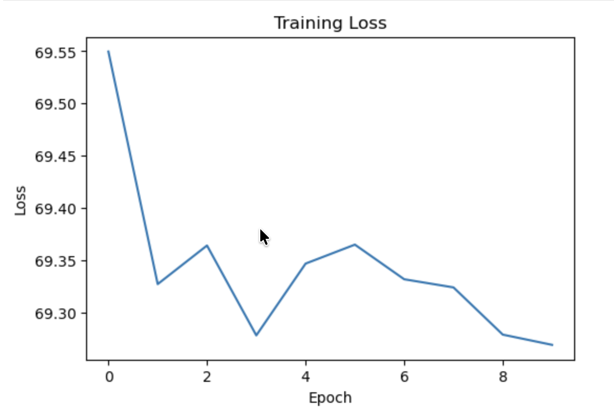
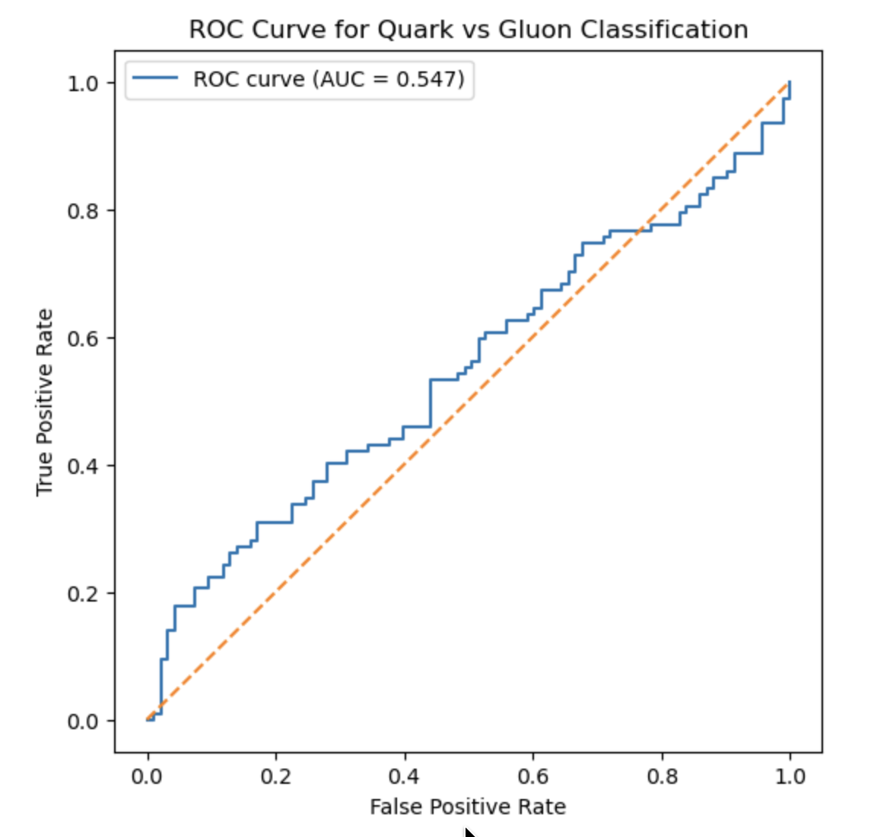

# Deep Graph anomaly detection with contrastive learning for new physics searches

This project explores **deep learning and graph-based methods for quark–gluon jet classification** using detector image data.  
The goal is to learn meaningful representations of jet events using **Autoencoders, Graph Neural Networks (GNNs), and Contrastive Learning**.

This repository was developed as part of a **research-style machine learning project for particle physics datasets**.

---

# Project Overview

High-energy particle collisions produce **jets**, which originate from either:

- **Quarks**
- **Gluons**

Distinguishing between these two is an important task in particle physics.

The dataset represents jet events as **detector images** with three channels:

| Channel | Description |
|-------|-------------|
| ECAL | Electromagnetic calorimeter energy deposits |
| HCAL | Hadronic calorimeter energy deposits |
| Tracks | Charged particle tracks |

Each event is represented as:

3 × 125 × 125 image

---

# Methods Implemented

This project implements **three learning approaches**.

## 1 Autoencoder (Representation Learning)

A convolutional autoencoder learns a **compressed representation of jet images** and reconstructs them.

Purpose:
- Learn latent representation
- Understand detector energy patterns

---

## 2 Graph Neural Network (Jet Classification)

Jet images are converted into **graphs**:

- Nodes → non-zero energy pixels
- Edges → spatial nearest neighbors

Node features:

x coordinate  
y coordinate  
energy value  
detector channel  

A **Graph Convolutional Network (GCN)** is then trained to classify jets.

---

## 3 Contrastive Learning for Graph Representations

To improve representation quality, we train a **contrastive graph encoder** that learns embeddings by maximizing similarity between augmented graph views.

Pipeline:

Jet Image  
↓  
Graph Representation  
↓  
Graph Encoder  
↓  
Contrastive Learning  
↓  
Graph Embeddings  
↓  
Classifier  

---

# Repository Structure

GENIE  
│  
├── README.md  
├── requirements.txt  

├── src  
│   ├── dataset.py  
│   ├── graph_utils.py  
│   ├── models.py  
│   ├── train_autoencoder.py  
│   ├── train_gnn.py  
│   └── train_contrastive.py  

├── notebooks  

├── results  
│   ├── autoencoder_reconstruction.png  
│   ├── training_loss_curve.png  
│   └── roc_curve.png  

---

# Installation

Clone the repository:

git clone https://github.com/Vikramsolanki12/Genie.git  
cd Genie  

Install dependencies:

pip install -r requirements.txt  

---

# Dataset

Dataset used:

Quark–Gluon Jet Dataset (~139k jet events)

Due to file size, the dataset is **not included in the repository**.

Expected dataset format:

quark-gluon_data-set_n139306.hdf5  

Place the dataset inside:

data/

---

# Results

## Autoencoder Reconstruction

The autoencoder learns compressed jet representations and reconstructs detector images.

---

## Contrastive Training Loss

Contrastive learning loss decreases during training, indicating improved representation quality.

---

## ROC Curve (Jet Classification)

Final classifier performance evaluated using ROC-AUC.

---

# Experimental Results

| Method | Performance |
|------|-------------|
| Autoencoder | Successful reconstruction |
| Graph Neural Network | ~50-60% accuracy |
| Contrastive Graph Learning | ~50–55% accuracy |
| ROC-AUC | ~0.54 |

---

# Hardware Limitations

This project was trained on:

MacBook Air M1  
8 GB RAM  
Apple Metal GPU (MPS)

Graph Neural Networks are **memory intensive**, especially when processing large graphs.

Due to hardware constraints:

- dataset size was reduced
- node count per graph was limited
- batch size was kept small

This resulted in **lower accuracy compared to high-performance systems**.

---

# How to Achieve Higher Accuracy

To reproduce **better performance (~90%+)**, the following changes are recommended.

## Increase Dataset Size

In train_gnn.py change:

max_samples = 2000  

to

max_samples = 10000  

---

## Increase Graph Nodes

In graph_utils.py change:

max_nodes = 150  

to

max_nodes = 500  

This preserves more detector information.

---

## Increase Neighbor Connectivity

Change:

k = 5  

to

k = 10  

This captures richer jet structure.

---

## Increase Batch Size

batch_size = 4 → 16  

(if GPU memory allows)

---

## Train for More Epochs

epochs = 10 → 50  

---

## Use a Stronger GPU

Recommended hardware:

NVIDIA GPU (RTX / A100)  
Google Colab GPU  
HPC cluster  

---
